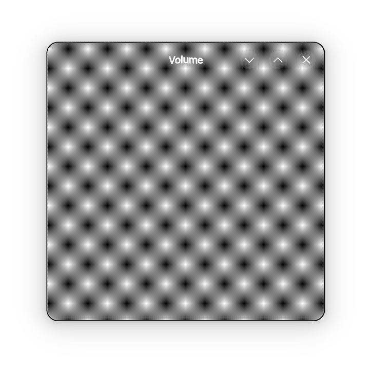

# GTK OpenGL

GTK implementation of https://github.com/Alex2772/wayland_egl.

This example demonstrates pixel perfect fractional scaling. To check, make a screenshot of the window, open it in an
image editor and zoom in close enough so editor will display pixels. If you see a perfect checkerboard pattern that
remains crisp on the whole surface, congratulations, everything is okay and your system is capable of displaying
fractional scale properly.